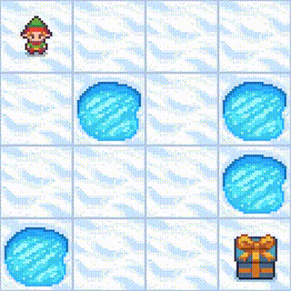
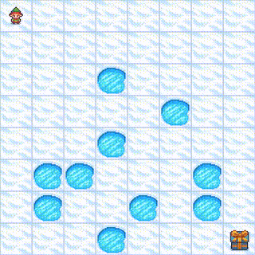
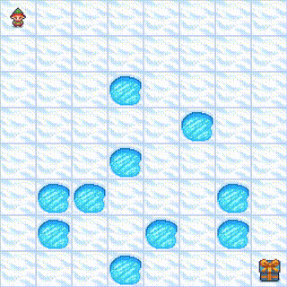

# FrozenLake RL Experiments

This repository contains Jupyter notebooks implementing Deep Q-Learning (DQN) on the FrozenLake environment from Gymnasium.

- **`01_frozenlake_4x4.ipynb`**: ✅  
  → 4×4 grid  
  → Deterministic (no slip)  
  → Fixed map layout  

- **`02_frozenlake_8x8.ipynb`**: ✅  
  → 8×8 grid  
  → Deterministic (no slip)  
  → Fixed map layout  

- **`03_frozenlake_8x8_slippery.ipynb`**: ✅
  → 8×8 grid  
  → Stochastic (slippery)  
  → Random map layout  

- **`04_frozenlake_8x8_random.ipynb`**: ⏰  
  → 8×8 grid  
  → Deterministic (no slip)  
  → Random map layout  

- **`05_frozenlake_8x8_random_slippery.ipynb`**: ⏰  
  → 8×8 grid  
  → Stochastic (slippery)  
  → Random map layout  
